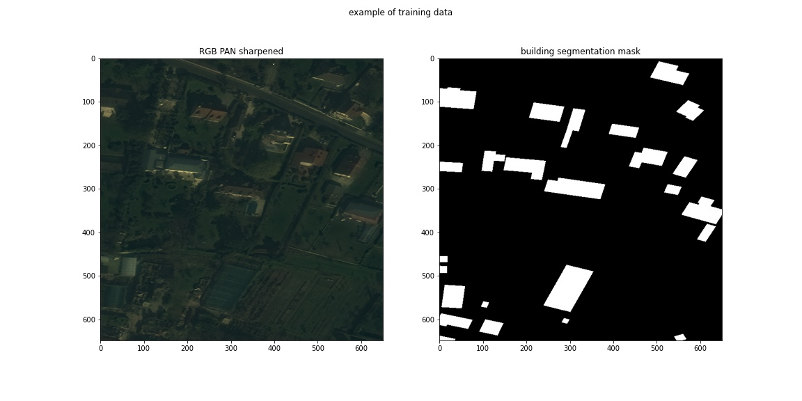

### Project proposal: Semantic Segmentation of buildings in satellite imagery

#### Problem Statement
Satellite imagery is becoming commonplace as the costs of satellites have come down. Automatic extraction of features such as buildings and roads using machine learning techniques such as neural networks can have an important role to play in diaster response, and improve map data for poorer areas of the world where there might be less incentive for commercial companies to spend mapping efforts. The aim of this project is to build a model and inference pipeline that can detect buildings from satellite imagery that is both accurate and efficient (both in terms of training and inference time, and model size).

#### Domain background
This project is based on the computer vision task of [semantic segmentation](https://en.wikipedia.org/wiki/Image_segmentation) applied to satellite imagery.

There are many model architectures for image segmentation. According to [paperswithcode](https://paperswithcode.com/sota/semantic-segmentation-on-cityscapes), some of the current top models (ranked on Mean IoU on the cityscapes dataset) are:

|RANK|MODEL|MEAN IOU (CLASS)|EXTRA TRAINING DATA|PAPER|CODE|RESULT|YEAR|
|--- |--- |--- |--- |--- |--- |--- |--- |
|1|HRNet-OCR (Hierarchical Multi-Scale Attention)|85.1%||Hierarchical Multi-Scale Attention for Semantic Segmentation|||2020|
|2|HRNetV2 + OCR +|84.5%||Object-Contextual Representations for Semantic Segmentation|||2019|
|3|EfficientPS|84.21%||EfficientPS: Efficient Panoptic Segmentation|||2020|
|4|Panoptic-DeepLab|84.2%||Panoptic-DeepLab: A Simple, Strong, and Fast Baseline for Bottom-Up Panoptic Segmentation|||2019|
|5|HRNetV2 + OCR (w/ ASP)|83.7%||Object-Contextual Representations for Semantic Segmentation|||2019|
|6|DCNAS|83.6%||DCNAS: Densely Connected Neural Architecture Search for Semantic Image Segmentation|||2020|
|7|DeepLabV3Plus + SDCNetAug|83.5%||Improving Semantic Segmentation via Video Propagation and Label Relaxation|||2018|
|8|GALDNet(+Mapillary)|83.3%||Global Aggregation then Local Distribution in Fully Convolutional Networks|||2019|
|9|ResNeSt200|83.3%||ResNeSt: Split-Attention Networks|||2020|
|10|HANet (Height-driven Attention Networks by LGE A&B)|83.2%||Cars Can't Fly up in the Sky: Improving Urban-Scene Segmentation via Height-driven Attention Networks|||2020|

In terms of building segmentation, a review of current models from [this paper](https://www.researchgate.net/publication/330004310_Building_Segmentation_of_Aerial_Images_in_Urban_Areas_with_Deep_Convolutional_Neural_Networks_IEREK_Interdisciplinary_Series_for_Sustainable_Development) shows the performance of top models as of 2019:

|Models |Precision |Recall| F1| Kappa |Overall Accuracy |
|--- |--- |--- |--- |--- |--- |
|[FCN-8s](https://arxiv.org/abs/1411.4038) |0.9163| 0.9102 |0.9132| 0.8875 |0.9602 |
|[SegNet](https://arxiv.org/pdf/1511.00561)|0.9338| 0.8098| 0.8674 |0.8314| 0.9431 |
|[DeconvNet](https://arxiv.org/pdf/1505.04366.pdf) |0.8529| 0.9001 |0.8758 |0.8375| 0.9413 |
|[U-Net](https://arxiv.org/abs/1505.04597) |0.8840 |0.9190 |0.9012| 0.8709| 0.9537 |
|[ResUNet](https://arxiv.org/abs/1904.00592)| 0.9074| 0.9315| 0.9193| 0.8948 |0.9624 |
|[DeepUNet](https://arxiv.org/abs/1709.00201)| 0.9269| 0.9245| 0.9257| 0.9035| 0.9659 |
|[DeepResUnet](https://www.mdpi.com/2072-4292/11/15/1774/pdf)| 0.9401 |0.9328 |0.9364| 0.9176| 0.9709 |

Interesting, we can see that some of the more 'traditional' segmentation models such as SegNet still comes up top whereas for more diverse scene understanding there are a lot more models coming out of research papers. Perhaps this is just a case of newer models not being tested on the task of building segmentation, or that the nature of the problem mean that it's not so efficient to do so.
#### Datasets
[Spacenet](https://spacenet.ai/datasets/) has provided a comprehensive dataset of labelled satellite imagery data that can be used for this project. I will be using the [SpaceNet AOI 3 – Paris](https://spacenet.ai/paris/) dataset for training. Other cities are also available on spacenet and as an extension, time permitting, I will try to see how well a model trained on one city performs on another.

The dataset is organised as follows:
```
AOI_3_Paris
    ├── MUL/             # geotiffs of 8-Band Multi-Spectral raster data from WorldView-3
    ├── MUL-PanSharpen/  # 8-Band Multi-Spectral raster data pansharpened to 0.3m
    ├── PAN/             # Panchromatic raster data from Worldview-3
    ├── RGB-PanSharpen/  # geotiffs of RGB raster data from Worldview-3 pansharpened to 0.3m
    ├── summaryData/     # building segmentation masks in csv format
    └── geojson/		     # building segmentation masks
```

For this project, I will be using the `RGB-PanSharpen` images. In the Paris dataset, there are 1148 RGB pansharpened satellite imagery that is 650 x 650 pixels wide. They are saved as tiff files which can be read into numpy arrays by scikit-image using the tifffile plugin. The segmentation masks are in the form of geojson files. An example of an image-segmentation pair is shown below:



#### Solution
My solution will be based on a pytorch model uses pretrained semantic segmentation networks, and fine tuned on labelled satellite data from the Spacenet dataset. The model is likely to be a variation on one of the well known semantic segmentation models such as [UNet](https://arxiv.org/abs/1505.04597) or [FastFCN](https://arxiv.org/abs/1903.11816). Some other options to explore include [PointRend](https://github.com/facebookresearch/detectron2/tree/master/projects/PointRend) and [graph convolution networks ](https://www.sciencedirect.com/science/article/pii/S092427161930259X)

#### Benchmark models
Spacenet has released winning models from the spacenet challenges at https://solaris.readthedocs.io/en/latest/pretrained_models.html Any of these can serve as a benchmark model. Quite a few of them are UNet based so it would be interesting to compare the performance of these with different architectures such as PointRend.

#### Evaluation metrics
I will be using the [Intersection over Union](https://medium.com/the-downlinq/the-spacenet-metric-612183cc2ddb) score for measuring how well the model is performing. This metric is very common in semantic segmentation tasks and is also used as the judging criteria in the SpaceNet building segmentation challenges.

#### Project design
1. Data preprocessing
  - splitting satellite imagery into smaller chips for training
  - data augmentation (can also be done as a step in the dataloader)
2. Initial model training
  - train simple model (e.g. UNet with Resnet34 backbone) for baseline
3. Model tuning
  - error analysis: which images is the model most likely to make a mistake?
  - hyperparameter tuning
  - experimenting with other architectures e.g. EfficientNet
4. Test on data from another city from spacenet datasets
5. Further model refinement and analysis for better generalisation
6. Deploy model as web app that people can upload satellite imagery to and get building locations
